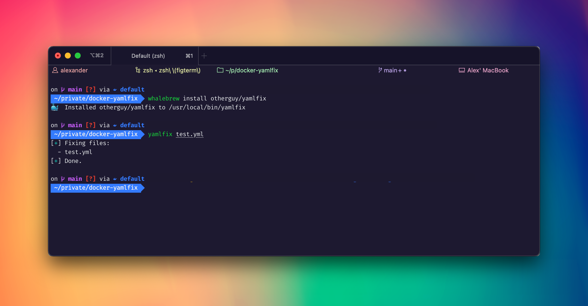

# `yamlfix` for 🐳 Docker

_This repository provides the [`otherguy/yamlfix`][dockerhub] image_

[][dockerhub]
[][dockerhub]
[][issues]
[][microbadger]
[][stargazers]
[][license]

[dockerhub]: https://hub.docker.com/r/otherguy/yamlfix/
[license]: https://tldrlegal.com/license/mit-license
[microbadger]: https://microbadger.com/images/otherguy/yamlfix
[stargazers]: https://github.com/otherguy/docker-yamlfix/stargazers
[issues]: https://github.com/otherguy/docker-yamlfix/issues

## 🌈 What is this?

[`yamlfix`](https://github.com/lyz-code/yamlfix) is a simple, opinionated yaml formatter that keeps your comments
and is written by [lyz](https://github.com/lyz-code/).

This Docker image intends to bring the awesomeness of [`yamlfix`](https://github.com/lyz-code/yamlfix) to Docker and especially [whalebrew](https://github.com/whalebrew/whalebrew).

## 🛠 Usage

You can use this with plain Docker:

    $ docker run --rm otherguy/yamlfix your_yaml_file.yaml

Or you can install it using [whalebrew](https://github.com/whalebrew/whalebrew) and use it simply with `yamlfix`:

    $ whalebrew install otherguy/yamlfix
    $ yamlfix your_yaml_file.yaml

## 🚧 Contributing

Bug reports and pull requests are welcome on GitHub at [`otherguy/docker-yamlfix`](https://github.com/otherguy/docker-yamlfix).

## ♥️ Acknowledgements

- [lyz](https://github.com/lyz-code/) for creating [`yamlfix`](https://github.com/lyz-code/yamlfix)
